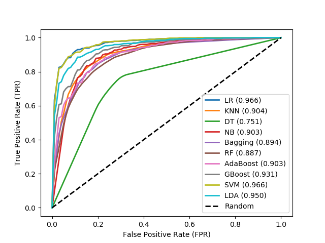
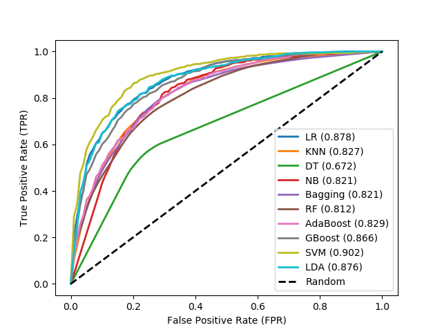

# Performance Measures on Protein Datasets

### 1. DNA-binding Protein, trained on PDB1075 dataset

Table 1: Different classifiers achieved during cross-fold validation on PDB1075 training dataset.

| Classifier | Accuracy (%) |  auROC | auPR   | Sn (%) |  Sp (%)  | F1-Score |  MCC   |
| :---       | :---:        | :---:  |  :---: | :---:  | :---:    | :---:    | ---:  |
|LR| 90.88 |0.9662|0.9717|91.36|90.42|0.9089|0.8186|
|SVM|89.67|0.9665|0.9714|90.69|88.80|0.8983|0.7967|
|KNN| 84.19 |0.9042|0.8778|84.48|83.94|0.8425|0.6851|
|Decision Tree|75.07|0.7509|0.6883|76.11|74.09|0.7527|0.5039|
|Naive Bayes|83.72|0.9031|0.8691|83.13|84.35|0.8362|0.6756|
|Bagging|82.70|0.8941|0.8755|80.70|84.75|0.8233|0.6569|
|Random Forest|80.65|0.8871|0.8619|76.92|84.35|0.7988|0.6160|
|AdaBoost|82.88|0.9031|0.9006|83.13|82.59|0.8291|0.6578|
|Gradient Boosting|85.30|0.9309|0.9338|86.77|83.94|0.8555|0.7096|
|LDA|87.63|0.9503|0.9563|88.26|87.04|0.8774|0.7541|

Note: The number of DNA-binding protein (+ve) sequences and the number of non-DNA-binding protein (-ve) sequences
are 525 and 550 respectively for the PDB1075 dataset.

&nbsp;

Figure 1: Receiver Operation Characteristic (ROC) curve for different classifiers achieved during cross-fold
validation on PDB1075 training dataset.

&nbsp;

### 2. DNA-binding Protein, tested on PDB186 dataset

Table 2: Different classifiers achieved during cross-fold validation on PDB186 testing dataset.

| Classifier | Accuracy (%) |  auROC | auPR   | Sn (%) |  Sp (%)  | F1-Score |  MCC   |
| :---       | :---:        | :---:  |  :---: | :---:  | :---:    | :---:    | :---:  |
|LR|83.33|0.8780|0.8357|71.93|89.36|0.7480|0.6259|
|SVM| 81.18 |0.9021|0.7921|70.58|86.57|0.7205|0.5783|
|KNN| 77.42 |0.8270|0.6715|68.29|81.79|0.6734|0.4990|
|Decision Tree |70.43|0.6722|0.4768|56.95|77.50|0.5706|0.3457|
|Naive Bayes |74.73|0.8208|0.6438|73.95|76.29|0.6769|0.4874|
|Bagging|76.34|0.8206|0.6837|53.04|88.21|0.6052|0.4480|
|Random Forest|75.27|0.8120|0.6699|49.80|88.36|0.5788|0.4211|
|AdaBoost|76.34|0.8294|0.7134|63.43|83.14|0.6496|0.4742|
|Gradient Boosting|78.49|0.8661|0.7706|67.21|86.71|0.6987|0.5519|
|LDA|79.57|0.8762|0.7817|71.93|86.93|0.7312|0.5937|

Note: The number of DNA-binding protein (+ve) sequences and the number of non-DNA-binding protein (-ve) sequences are 93 and  93 respectively for the PDB186 dataset.

&nbsp;

Figure 2: Receiver Operation Characteristic (ROC) curve for different classifiers achieved during cross-fold
validation on PDB186 testing dataset.

&nbsp;

We can [download](http://server.malab.cn/Local-DPP/Datasets.html) DNA-binding protein datasets (PDB1075 and PDB186) from given link.
